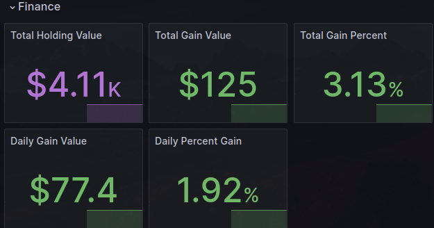

# Yahoo Finance Metrics for portfolios



This is a simple python script that scrapes the Yahoo Finance website for the current price current value of your portfolio and tells you some key metrics about it.

## Info

- yahoo_finance_total_holding_value ($)
- yahoo_finance_daily_gain_percent_value (%)
- yahoo_finance_daily_gain_value ($)
- yahoo_finance_total_gain_value ($)
- yahoo_finance_total_gain_percent_value (%)

## Prerequisites

In order to use this you must get the cookies for your Yahoo Finance account. You can do this by logging into your account and then using the developer tools in your browser to get the cookies.

## Usage

1. Clone this repo
2. Install the requirements
3. Run the script

```bash
git clone
cd yahoo-finance-metrics
```

### Docker Usage

```bash
docker build -t yahoo-finance-metrics .
sh run.sh
```

### Rust Usage

- Must have rustup installed with cargo and rustc
- Must place the config.jsonn file into /etc/yahoo-finance-metrics/config.json

```bash
cargo build --release
# Run the binary
./target/release/yahoo-finance-metrics
```

## TODO

- [ ] Add more metrics
- [ ] Add more support for different OS's
